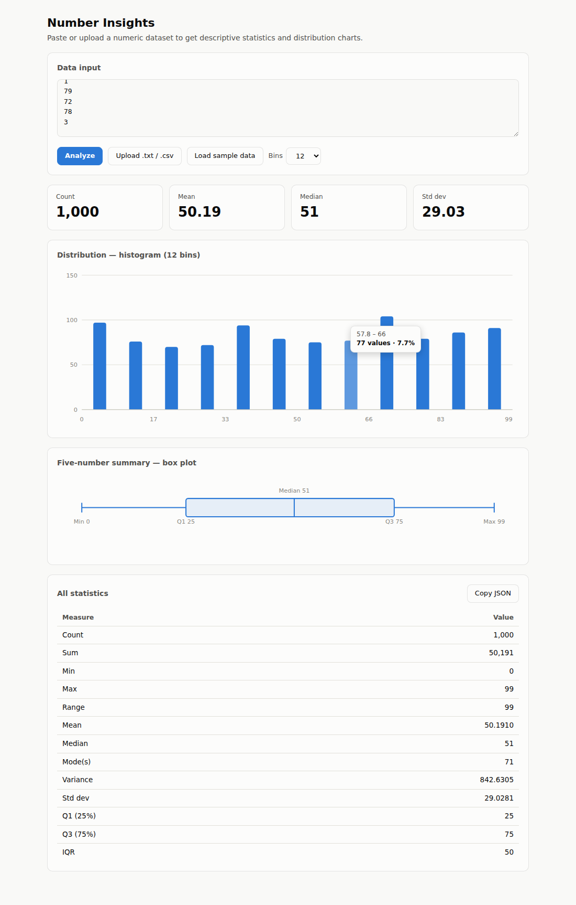
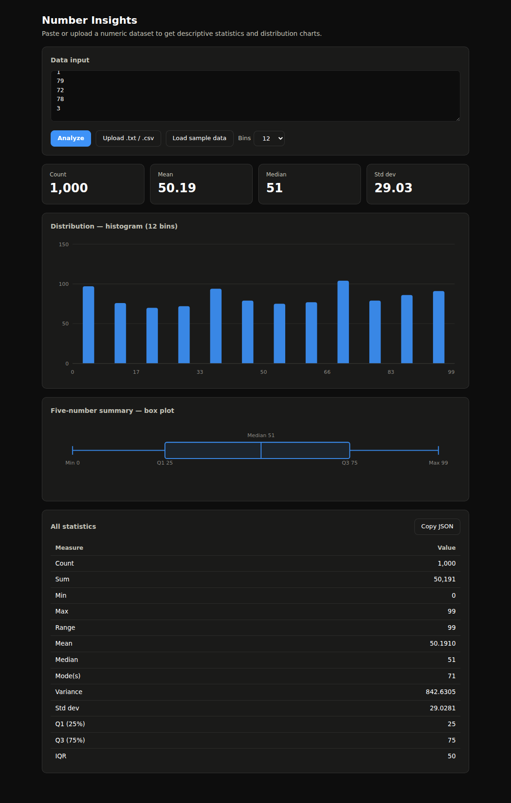

# Number Insights

[](https://github.com/eerbek05/lab13/actions/workflows/ci.yml)
[](https://openjdk.org/projects/jdk/21/)
[](https://maven.apache.org/)
[](LICENSE)

A **statistical analysis tool** for numeric datasets, written in modern Java, with
two front-ends sharing one analysis engine:

- a **CLI** that prints descriptive statistics and an ASCII histogram to the terminal;
- a **web UI** (`--serve`) where you paste or upload data and get interactive SVG
  charts, stat tiles and a full statistics table in the browser.

No frameworks, no external runtime dependencies — the web server is the JDK's own
`HttpServer` and the frontend is a single self-contained page (vanilla JS + SVG).



> Number Insights grew out of a university stream-processing exercise ("Lab 13").
> The original coursework — a set of Java `Stream` pipelines over a 1000-value
> dataset — lives on inside the `analysis` layer, and its exact results are still
> pinned by regression tests. Everything else was built around it to turn a single
> homework file into a small, well-structured application.

---

## Features

- **Descriptive statistics** — count, sum, min, max, range, mean, median, mode(s),
  variance, standard deviation, quartiles (Q1/Q3) and inter-quartile range.
- **Interactive web UI** — paste or upload data in the browser; get stat tiles, a
  hoverable SVG histogram with adjustable bin count, a box plot of the five-number
  summary, a full statistics table and one-click JSON export. Automatic light/dark
  theme.
- **ASCII histogram** — see the shape of the distribution (skew, spread, modality)
  right in your terminal.
- **JSON API** — `POST /api/analyze` takes raw numeric text and returns statistics
  plus histogram bins, so the analysis engine is scriptable from any language.
- **Flexible input** — one-number-per-line text files *or* delimited data
  (comma / semicolon / tab / space), so plain `.txt` and `.csv` both work.
  Blank lines and `#` comments are ignored.
- **Multiple output formats** — human-readable `table` or machine-readable `json`.
- **Robust CLI** — clear error messages, `--help`, and proper exit codes.
- **Zero runtime dependencies** — pure JDK; JUnit is used for tests only.

## Quick start

```bash
# Build a runnable JAR (tests run automatically)
mvn package

# Option 1: web UI — open http://localhost:8080 and paste your data
java -jar target/number-insights.jar --serve

# Option 2: terminal analysis
java -jar target/number-insights.jar sample-data/numbers.txt --stats --histogram
```

### Example output

```
Loaded 1000 values from sample-data/numbers.txt

Descriptive Statistics
======================
Count        : 1000
Sum          : 50191
Min          : 0
Max          : 99
Range        : 99
Mean         : 50.1910
Median       : 51.0000
Mode         : 71
Variance     : 842.6305
Std Dev      : 29.0281
Q1 (25%)     : 25.0000
Q3 (75%)     : 75.0000
IQR          : 50.0000

Distribution
============
     0.0 -      8.3 | ##################################### 97
     8.3 -     16.5 | ############################# 76
    16.5 -     24.8 | ########################### 70
    24.8 -     33.0 | ############################ 72
    33.0 -     41.3 | #################################### 94
    41.3 -     49.5 | ############################## 79
    49.5 -     57.8 | ############################# 75
    57.8 -     66.0 | ############################## 77
    66.0 -     74.3 | ######################################## 104
    74.3 -     82.5 | ############################## 79
    82.5 -     90.8 | ################################# 86
    90.8 -     99.0 | ################################### 91
```

## Usage

```
number-insights <file> [options]

OPTIONS:
  --stats           Print descriptive statistics (default)
  --histogram       Print an ASCII histogram of the distribution
  --format <type>   Statistics output format: table (default) or json
  --serve           Start the web UI (paste or upload data in the browser)
  --port <n>        Port for --serve mode (default 8080)
  -h, --help        Show help

EXAMPLES:
  number-insights data.txt
  number-insights data.csv --stats --histogram
  number-insights data.txt --format json
  number-insights --serve --port 9000
```

### Web UI & JSON API

`--serve` starts an embedded web server (the JDK's own `HttpServer` — no servlet
container). The single-page frontend is bundled into the JAR; open the printed URL,
paste or upload your data and explore the charts. The dark theme follows your OS
preference:



The same endpoint the UI uses is a plain JSON API:

```bash
curl -X POST --data-binary @sample-data/numbers.txt "http://localhost:8080/api/analyze?bins=12"
```
```json
{
  "stats":     { "count": 1000, "mean": 50.1910, "median": 51.0000, "stdDev": 29.0281, ... },
  "histogram": [ { "low": 0.0, "high": 8.25, "count": 97 }, ... ]
}
```

JSON output pipes cleanly into other tools:

```bash
java -jar target/number-insights.jar sample-data/numbers.txt --format json
```
```json
{
  "count": 1000,
  "sum": 50191,
  "mean": 50.1910,
  "median": 51.0000,
  "modes": [71],
  "stdDev": 29.0281,
  "q1": 25.0000,
  "q3": 75.0000,
  "iqr": 50.0000
}
```

## Architecture

The application is organised into small, single-responsibility layers. Two
front-ends drive the same engine — the terminal and the browser — so adding the
web UI required no changes to any analysis code:

```
                       ┌─→ CLI (Main)      → ReportFormatter/Histogram → stdout
DataLoader → Dataset ──┤
                       └─→ WebServer (JSON API) → browser UI (SVG charts)
```

| Package    | Responsibility                                                        |
|------------|-----------------------------------------------------------------------|
| `cli`      | Parse command-line arguments (`CliOptions`)                           |
| `io`       | Read and parse text/CSV input (`DataLoader`)                          |
| `model`    | The immutable `Dataset` shared by every analyzer                     |
| `stats`    | Descriptive statistics (`DescriptiveStatistics`, `StatisticsResult`) |
| `analysis` | The original Lab 13 stream pipelines (`StreamAnalyzer`)              |
| `viz`      | Histogram binning + ASCII rendering (`Histogram`)                    |
| `report`   | Table / JSON formatting (`ReportFormatter`)                          |
| `web`      | Embedded HTTP server + JSON API (`WebServer`)                        |

Because each layer depends only on the one beneath it and the model is immutable,
every component is independently unit-testable — see `src/test`. The histogram is
one example of the payoff: `Histogram.computeBins` is computed once and rendered
twice — as ASCII in the terminal and as SVG in the browser.

## Project layout

```
number-insights/
├── pom.xml                     # Maven build (JUnit 5, shade fat-jar)
├── .github/workflows/ci.yml    # GitHub Actions: build + test on every push
├── docs/                       # Screenshots
├── sample-data/                # Example .txt and .csv inputs
├── src/main/java/...           # Application sources
├── src/main/resources/web/     # Single-page frontend (vanilla JS + SVG)
└── src/test/java/...           # 48 JUnit 5 tests
```

## Development

```bash
mvn test        # run the test suite (48 tests)
mvn package     # run tests and build target/number-insights.jar
mvn verify      # full build used by CI
```

### Testing

The suite covers every layer: statistics correctness (against textbook values),
input parsing (delimiters, comments, error reporting), histogram binning, CLI
argument handling, HTTP integration tests that drive a real `WebServer` instance
over the JDK's `HttpClient`, and the original coursework regression tests that pin
the exact stream-pipeline results.

## Tech stack

- **Java 21** (records, switch expressions, text blocks, streams)
- **JDK `HttpServer`** for the embedded web server — no framework
- **Vanilla JS + SVG** frontend — no build step, no CDN, fully self-contained
- **Maven** for build & dependency management
- **JUnit 5** for testing
- **GitHub Actions** for continuous integration

## License

Released under the [MIT License](LICENSE).
