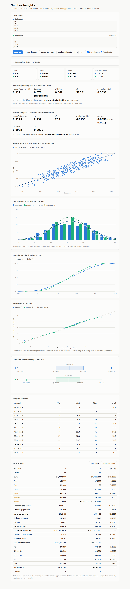

# Number Insights

[](https://github.com/eerbek05/lab13/actions/workflows/ci.yml)
[](https://openjdk.org/projects/jdk/21/)
[](https://maven.apache.org/)
[](LICENSE)

A **statistical analysis application** for numeric datasets, written in modern Java,
with two front-ends sharing one analysis engine:

- a **CLI** that prints descriptive statistics, a one-sample t-test and an ASCII
  histogram to the terminal;
- a **web UI** (`--serve`) covering the full toolkit of an introductory statistics
  course: descriptive statistics, frequency tables, histograms with normal-curve
  overlays, ECDF and Q-Q plots, box plots, and hypothesis tests (one-sample /
  paired / Welch's t, one-way ANOVA, chi-square, Jarque-Bera) for **one to four
  datasets** at a time.

No frameworks, no external runtime dependencies — the web server is the JDK's own
`HttpServer` on virtual threads, every p-value is computed in-house, and the
frontend is a single self-contained page (vanilla JS + SVG).


> Number Insights grew out of a university stream-processing exercise ("Lab 13").
> The original coursework — a set of Java `Stream` pipelines over a 1000-value
> dataset — lives on inside the `analysis` layer, and its exact results are still
> pinned by regression tests. Everything else was built around it to turn a single
> homework file into a small, well-structured application.

---

## Features

- **Full descriptive statistics** — count, sum, min/max/range, mean, median,
  mode(s), population *and* sample variance/std dev, skewness, excess kurtosis,
  coefficient of variation, standard error, 95% confidence interval of the mean,
  percentiles (P5/Q1/Q3/P95), IQR, Tukey fences with the **outlier values listed**,
  and the **Jarque-Bera normality test**. Decimal data is fully supported.
- **Hypothesis tests** — **one-sample t** (test the mean against a hypothesised
  µ₀), **paired t** (before/after designs), **Welch's two-sample t** with Cohen's
  d, **one-way ANOVA** for three or four groups (F, df, p, group means), and
  **chi-square** goodness-of-fit / independence for categorical counts — each with
  exact p-values and a plain-language significance verdict.
- **Correlation & regression** — in paired mode: Pearson r (with p-value),
  Spearman rho, and the least-squares line with R², drawn over a scatter plot.
- **Distribution charts** — histogram with **normal-curve overlay**, **ECDF**,
  **normal Q-Q plot**, box plots on a shared scale, and a classic **frequency
  table** (f, %, cumulative) — for every dataset side by side, with aligned bins.
- **Compare up to four datasets** — grouped histograms, overlaid ECDFs, per-set
  Q-Q points, stacked box plots and an A/B/C/D statistics table (delta column for
  two sets).
- **Interactive web UI** — stat tiles, hover tooltips everywhere, adjustable bin
  count, CSV **column picker** for multi-column files, one-click **JSON export**,
  **z-score export** and a **downloadable standalone HTML report**. Automatic
  light/dark theme.
- **ASCII histogram & t-test in the terminal** — `--histogram`, `--test-mean`.
- **JSON API** — `/api/analyze`, `/api/compare`, `/api/chisquare` and `/health`
  take raw text and return the full analysis, so the engine is scriptable from
  any language.
- **Hardened embedded server** — virtual-thread-per-request executor, request
  body and dataset-size caps (413 on overflow), request/response time bounds,
  security headers (CSP, nosniff), access logging via `System.Logger`, graceful
  shutdown, and a `/health` probe with the build version.
- **Flexible input** — one-number-per-line text files *or* delimited data
  (comma / semicolon / tab / space), so plain `.txt` and `.csv` both work.
  Blank lines and `#` comments are ignored.
- **Zero runtime dependencies** — pure JDK; Student-t, F and chi-square p-values
  are computed in-house (Lanczos log-gamma, continued-fraction incomplete beta,
  regularized incomplete gamma). JUnit is used for tests only.

## Quick start

```bash
# Build a runnable JAR (tests run automatically)
mvn package

# Option 1: web UI — open http://localhost:8080 and paste your data
java -jar target/number-insights.jar --serve

# Option 2: terminal analysis
java -jar target/number-insights.jar sample-data/numbers.txt --stats --histogram
```

### Example output

```
Loaded 1000 values from sample-data/numbers.txt

Descriptive Statistics
======================
Count        : 1000
Sum          : 50191
Min          : 0
Max          : 99
Range        : 99
Mean         : 50.1910
Median       : 51.0000
Mode         : 71
Variance     : 842.6305
Std Dev      : 29.0281
Sample Var   : 843.4740
Sample Std   : 29.0426
Skewness     : -0.0656
Kurtosis*    : -1.2232
CV           : 0.5786
Std Error    : 0.9184
95% CI       : [48.3909, 51.9911]
P5           : 4.0000
Q1 (25%)     : 25.0000
Q3 (75%)     : 75.0000
P95          : 94.0000
IQR          : 50.0000
Fences       : [-50.0000, 150.0000]
Outliers     : 0
JB test      : 63.0451 (p = 0.0000)
(*) excess kurtosis: 0 = normal distribution; JB = Jarque-Bera normality test

Distribution
============
     0.0 -      8.3 | ##################################### 97
     8.3 -     16.5 | ############################# 76
    16.5 -     24.8 | ########################### 70
    24.8 -     33.0 | ############################ 72
    33.0 -     41.3 | #################################### 94
    41.3 -     49.5 | ############################## 79
    49.5 -     57.8 | ############################# 75
    57.8 -     66.0 | ############################## 77
    66.0 -     74.3 | ######################################## 104
    74.3 -     82.5 | ############################## 79
    82.5 -     90.8 | ################################# 86
    90.8 -     99.0 | ################################### 91
```

## Usage

```
number-insights <file> [options]

OPTIONS:
  --stats           Print descriptive statistics (default)
  --histogram       Print an ASCII histogram of the distribution
  --format <type>   Statistics output format: table (default) or json
  --test-mean <m>   Run a one-sample t-test of the mean against m
  --serve           Start the web UI (paste or upload data in the browser)
  --port <n>        Port for --serve mode (default 8080)
  -h, --help        Show help

EXAMPLES:
  number-insights data.txt
  number-insights data.csv --stats --histogram
  number-insights data.txt --test-mean 50
  number-insights --serve --port 9000
```

### Web UI & JSON API

`--serve` starts an embedded web server (the JDK's own `HttpServer` — no servlet
container). The single-page frontend is bundled into the JAR; open the printed URL,
paste or upload your data and explore the charts.

**Comparing datasets** — click *"+ Add dataset"* (up to four). Two datasets get
Welch's t-test — and, with *Paired data* ticked, a paired t-test, Pearson/Spearman
correlation, and a scatter plot with the least-squares line. Three or four
datasets get one-way ANOVA. Histogram bins are aligned server-side over the
combined range, ECDFs overlay, and box plots share one scale. Note the classic
paired-design lesson visible below: Welch says "not significant" while the paired
test detects the shift.



The dark theme follows your OS preference (three-group ANOVA shown):


The same endpoints the UI uses form a plain JSON API:

```bash
# Single dataset (+ optional one-sample t-test against mu)
curl -X POST --data-binary @sample-data/numbers.txt "http://localhost:8080/api/analyze?bins=12&mu=50"

# Two datasets separated by a --- line (add &paired=1 for the paired analysis)
printf '1 2 3 4 5 6 7 8\n---\n5 6 7 8 9 10 11 12\n' | \
  curl -X POST --data-binary @- "http://localhost:8080/api/compare?bins=8"

# Three or four datasets -> one-way ANOVA
printf '1 2 3\n---\n2 3 4\n---\n6 7 8\n' | \
  curl -X POST --data-binary @- "http://localhost:8080/api/compare"

# Chi-square: one row = goodness-of-fit, a table = independence
printf '10, 20\n20, 10\n' | curl -X POST --data-binary @- "http://localhost:8080/api/chisquare"

# Liveness probe
curl "http://localhost:8080/health"
```
```json
{
  "a": { "stats": {...}, "histogram": [...], "percentiles": [...], "outliers": [...] },
  "b": { "stats": {...}, "histogram": [...], "percentiles": [...], "outliers": [...] },
  "comparison": { "meanDifference": -4.0, "cohensD": -1.633,
                  "tStatistic": -3.266, "degreesOfFreedom": 14.0, "pValue": 0.005617 }
}
```

The server is hardened for unattended local use: request bodies over 5 MB are
rejected with 413, datasets are capped at 200k values, slow clients are timed
out, every request runs on its own virtual thread and is access-logged, and all
responses carry security headers.

JSON output pipes cleanly into other tools:

```bash
java -jar target/number-insights.jar sample-data/numbers.txt --format json
```
```json
{
  "count": 1000,
  "sum": 50191,
  "mean": 50.1910,
  "median": 51.0000,
  "modes": [71],
  "stdDev": 29.0281,
  "q1": 25.0000,
  "q3": 75.0000,
  "iqr": 50.0000
}
```

## Architecture

The application is organised into small, single-responsibility layers. Two
front-ends drive the same engine — the terminal and the browser — so adding the
web UI required no changes to any analysis code:

```
                       ┌─→ CLI (Main)      → ReportFormatter/Histogram → stdout
DataLoader → Dataset ──┤
                       └─→ WebServer (JSON API) → browser UI (SVG charts)
```

| Package    | Responsibility                                                        |
|------------|-----------------------------------------------------------------------|
| `cli`      | Parse command-line arguments (`CliOptions`)                           |
| `io`       | Read and parse text/CSV input (`DataLoader`)                          |
| `model`    | The immutable `Dataset` shared by every analyzer                     |
| `stats`    | Descriptives + Jarque-Bera (`DescriptiveStatistics`), inference (`Inference`: t-tests, ANOVA, chi-square), correlation/regression (`Bivariate`) |
| `analysis` | The original Lab 13 stream pipelines (`StreamAnalyzer`)              |
| `viz`      | Histogram binning (own or shared range) + ASCII rendering (`Histogram`) |
| `report`   | Table / JSON formatting (`ReportFormatter`)                          |
| `web`      | Embedded HTTP server + JSON API (`WebServer`)                        |

Because each layer depends only on the one beneath it and the model is immutable,
every component is independently unit-testable — see `src/test`. The histogram is
one example of the payoff: `Histogram.computeBins` is computed once and rendered
twice — as ASCII in the terminal and as SVG in the browser.

## Project layout

```
number-insights/
├── pom.xml                     # Maven build (JUnit 5, shade fat-jar)
├── .github/workflows/ci.yml    # GitHub Actions: build + test on every push
├── docs/                       # Screenshots
├── sample-data/                # Example .txt and .csv inputs
├── src/main/java/...           # Application sources
├── src/main/resources/web/     # Single-page frontend (vanilla JS + SVG)
└── src/test/java/...           # 102 JUnit 5 tests
```

## Development

```bash
mvn test        # run the test suite (102 tests)
mvn package     # run tests and build target/number-insights.jar
mvn verify      # full build used by CI
```

### Testing

The suite covers every layer: statistics correctness (skewness/kurtosis against
spreadsheet-verified values, Jarque-Bera against hand-computed moments), the
p-value numerics (log-gamma against Γ identities; t, F and chi-square p-values
against classic table critical values like *t(0.025, df=10) = 2.228*,
*F(0.05; 2, 6) = 5.143* and the χ²(2) identity *p = e^(−x/2)*), ANOVA and the
t-tests against hand computations, correlation/regression on exact lines, input
parsing (decimals, delimiters, comments, error reporting), histogram binning
(own and shared ranges), CLI argument handling, HTTP integration tests that
drive a real `WebServer` over the JDK's `HttpClient` (all five endpoints,
including the 413 body-size guard), and the original coursework regression
tests that pin the exact stream-pipeline results.

## Tech stack

- **Java 21** (records, switch expressions, text blocks, streams)
- **JDK `HttpServer`** for the embedded web server — no framework
- **Vanilla JS + SVG** frontend — no build step, no CDN, fully self-contained
- **Maven** for build & dependency management
- **JUnit 5** for testing
- **GitHub Actions** for continuous integration

## License

Released under the [MIT License](LICENSE).
